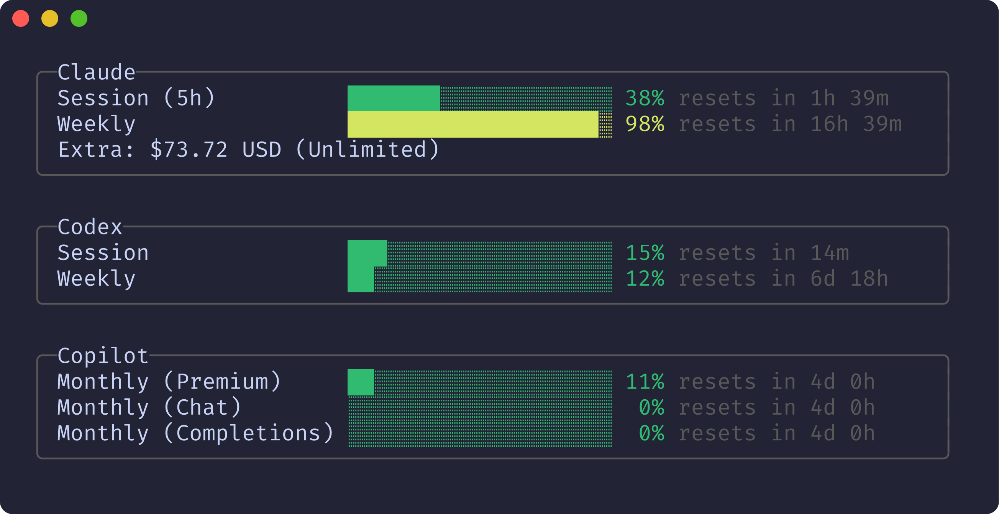
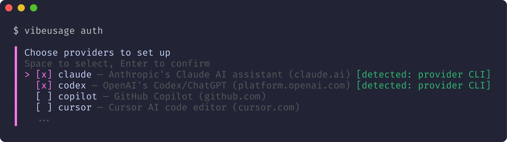
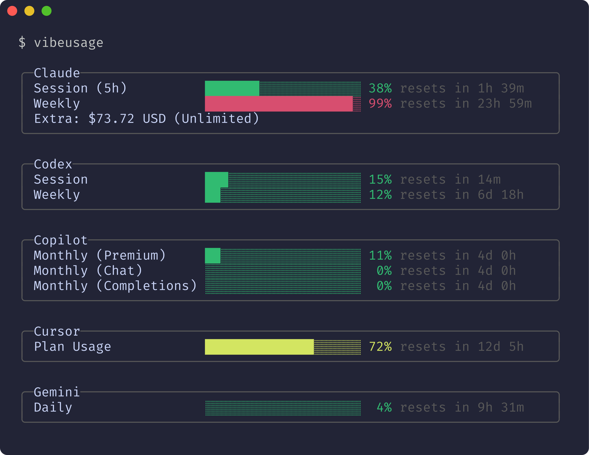
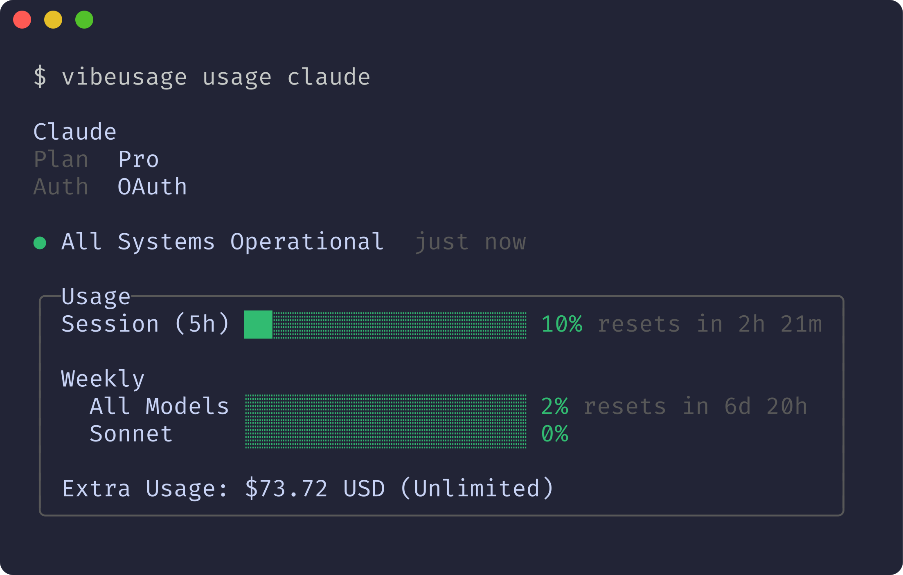
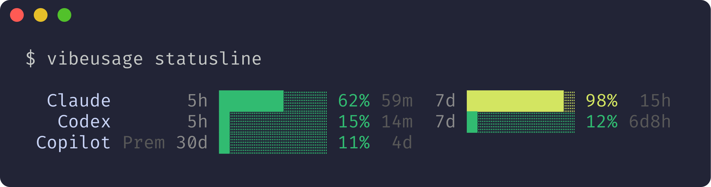
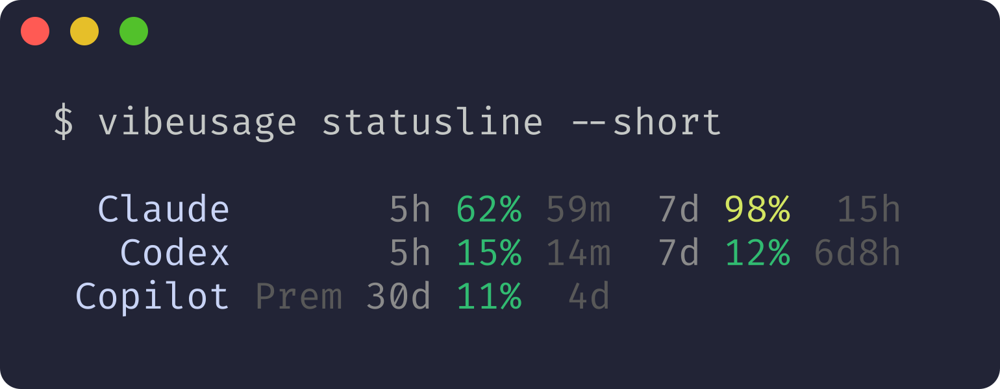
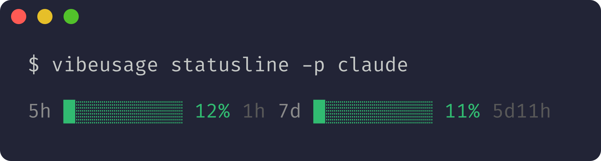
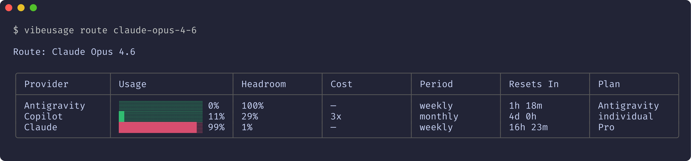
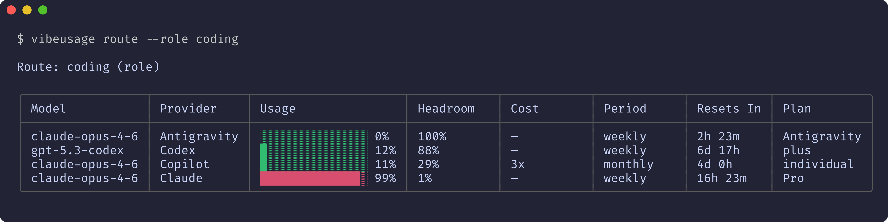
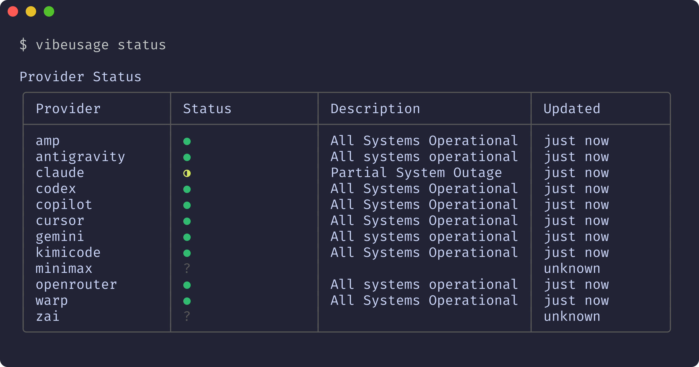

# vibeusage

Track usage across agentic LLM providers from your terminal.



I get free access to GitHub Copilot Pro for my OSS contributions (thanks GitHub!), but I consistently forget to use it and every month leave free usage on the table. vibeusage keeps that visible across providers and gives you one place to see account usage, pace, and remaining headroom across your configured providers.

## Installation

### Quick install

macOS/Linux/Windows Subsystem for Linux (WSL):

```bash
curl -fsSL https://raw.githubusercontent.com/joshuadavidthomas/vibeusage/main/install.sh | sh
```

Windows (PowerShell):

```powershell
iwr https://raw.githubusercontent.com/joshuadavidthomas/vibeusage/main/install.ps1 -useb | iex
```

Install scripts place the binary in `~/.local/bin` by default (override with `VIBEUSAGE_INSTALL_DIR`). Ensure that directory is on your `PATH`.

### Homebrew

```bash
brew tap joshuadavidthomas/homebrew
brew install vibeusage
```

### Go install

If you have [Go](https://go.dev/) available, you can also use:

```bash
go install github.com/joshuadavidthomas/vibeusage@latest
```

Or install from source:

```bash
git clone https://github.com/joshuadavidthomas/vibeusage.git
cd vibeusage
go build -o vibeusage ./cmd/vibeusage
```

## Quick Start

Set up the providers you use:

```bash
vibeusage auth
```



Providers with existing CLI credentials are detected automatically — just select them and hit Enter. For others, vibeusage walks you through authentication (API keys, device flows, or browser tokens).

Then check your usage:
```bash
vibeusage
```



Bars are pace-colored by burn rate: **green** (on track or within 15% of expected), **yellow** (15–30% over expected pace), **red** (well over pace or near exhaustion). Pace compares your actual usage percentage to the fraction of time elapsed in the period.

Only providers you explicitly enable via `vibeusage auth` are tracked. Run it again anytime to add, remove, or re-authenticate providers.

## Viewing Usage

Check all enabled providers:

```bash
vibeusage
```

Check a specific provider:

```bash
vibeusage usage claude
```



Output as JSON for scripting or automation:

```bash
vibeusage --json
vibeusage usage codex --json
```

Skip cache and fail fast if APIs are unreachable:

```bash
vibeusage --no-cache
```

## Statusline

For status bars and scripts, `vibeusage statusline` outputs condensed usage:

```bash
vibeusage statusline
```



Compact text format for space-constrained widgets:

```bash
vibeusage statusline --short
```



Filter to specific providers (single provider omits the label):

```bash
vibeusage statusline -p claude
```



```bash
vibeusage statusline -p claude -p codex  # Multiple providers
vibeusage statusline --limit 1           # Only the most urgent period per provider
```

## Smart Routing

Inspired by OpenRouter-style routing, `vibeusage route` picks the best provider for a model based on real usage headroom from your own connected accounts.

You can route a model to the provider with the best current headroom:

```bash
vibeusage route claude-opus-4-6
```



Or route via your own role/model group:

```bash
vibeusage route --role coding
```



Not sure which model ID to use?

```bash
vibeusage route --list
vibeusage route --list-roles
```

If a model name is close but not exact, vibeusage suggests likely matches.

Role-based model groups are configured in `config.toml` under `[roles.<name>]` (see [Routing Roles](#routing-roles)).

## Managing Providers

### Authentication

Run `vibeusage auth` to enable providers interactively, or `vibeusage auth <provider>` for a specific one. For providers with existing CLI credentials (Claude Code, Codex CLI, Gemini CLI, etc.), vibeusage detects them and offers to reuse them. Otherwise, it walks you through the appropriate auth flow.

Enable or reconfigure providers interactively:

```bash
vibeusage auth                 # Select from all providers
vibeusage auth claude          # Configure specific provider
```

Check what's configured and credential status:

```bash
vibeusage auth --status
```

Remove credentials for a provider:

```bash
vibeusage auth claude --delete
```

Set credentials non-interactively (useful for CI or dotfiles):

```bash
vibeusage auth openrouter --token sk-or-...
```

Providers with existing CLI credentials (Claude Code, Codex CLI, Gemini CLI, etc.) are detected automatically and offered for reuse.

### Status

Check the operational status of all providers:

```bash
vibeusage status
```



Status fetches the current operational status from each provider's API status page (where available). ● indicates all systems operational, ◐ indicates a service disruption, and ? means status could not be determined. Use this to check if a provider is experiencing outages before troubleshooting credential issues.

### Provider list

#### Amp

[ampcode.com](https://ampcode.com) — Amp coding assistant. Reports Amp Free daily quota usage and credit balance.

If you have the Amp CLI installed, vibeusage reads credentials from `~/.local/share/amp/secrets.json` automatically. It also picks up `AMP_API_KEY` if you already have it set. Otherwise:

```bash
vibeusage auth amp
```

#### Claude Code Pro/Max

> [!IMPORTANT]
> **On Terms of Service:** Anthropic's [Consumer Terms of Service](https://www.anthropic.com/legal/terms) broadly restrict automated access to their services, and their [Claude Code legal docs](https://code.claude.com/docs/en/legal-and-compliance) (updated February 2026) state that using OAuth tokens in third-party tools is not permitted. vibeusage makes **zero inference requests** — it only reads a usage percentage, the equivalent of checking your data plan on your carrier's website. We believe this is defensible, but want to be transparent: under a strict reading of the TOS, this tool may technically be in violation. We'd happily switch to a sanctioned API if Anthropic ever provides one (a read-only usage endpoint on regular API keys would be perfect 🙏).

[claude.ai](https://claude.ai) — Anthropic's Claude AI assistant. Reports session (5-hour) and weekly usage periods, plus overage spend if enabled. Shows your plan tier (Pro, Max, etc.).

If you have Claude Code installed, vibeusage reads its OAuth credentials automatically — from `~/.claude/.credentials.json` on Linux/Windows, or from macOS Keychain on macOS — including token refresh. This is the recommended path.

As a fallback, you can authenticate with a browser session key:

```bash
vibeusage auth claude
```

This prompts you to copy the `sessionKey` cookie from https://claude.ai (DevTools → Application → Cookies). Session keys don't auto-refresh, so you'll need to re-auth when they expire.

> [!NOTE]
> **On Anthropic API keys:** Regular API keys (`sk-ant-api03-*`) from the [Anthropic console](https://platform.claude.com/settings/keys) **cannot** access Pro/Max plan usage data. They live in a completely separate billing system (pay-per-token) with no connection to consumer plan rate limits. This is why vibeusage uses OAuth credentials or session cookies instead.

#### Cursor

[cursor.com](https://cursor.com) — AI-powered code editor. Reports monthly premium request usage and on-demand spend. Shows your membership type.

Cursor requires a browser session token:

```bash
vibeusage auth cursor
```

The prompt walks you through extracting your session cookie from https://cursor.com (DevTools → Application → Cookies). You can also set it directly with `vibeusage auth cursor --token <value>`.

#### Google Antigravity

[antigravity.google](https://antigravity.google) — Google's AI IDE. Reports per-model usage quotas. Shows your subscription tier.

vibeusage reads credentials from the local Antigravity IDE state automatically. Just sign into Antigravity and it should work — no manual setup needed.

#### Google Gemini CLI

[gemini.google.com](https://gemini.google.com) — Google Gemini AI. Reports daily per-model request quotas. Shows your user tier.

If you have the Gemini CLI installed, vibeusage reads its OAuth credentials from `~/.gemini/oauth_creds.json` automatically — including token refresh. This gives you the full quota view from the Cloud Code API.

You can also use an AI Studio API key:

```bash
# If you already have GEMINI_API_KEY set, it just works
vibeusage usage gemini

# Otherwise, set one up:
vibeusage auth gemini
```

The API key path reports rate-limit-based usage (requests per minute/day) rather than quota percentages.

#### GitHub Copilot

[github.com/features/copilot](https://github.com/features/copilot) — GitHub's AI pair programmer. Reports monthly usage across premium interactions, chat, and completions quotas. [Smart routing](#smart-routing) takes into account the multiplier Copilot applies to model requests when considering the Copilot provider.

vibeusage reuses existing Copilot credentials from `~/.config/github-copilot/hosts.json` when available. If you don't have those, authenticate via device flow:

```bash
vibeusage auth copilot
```

This opens a browser-based GitHub authorization flow — you'll get a device code to enter at github.com/login/device.

#### Kimi Code

[kimi.com](https://www.kimi.com) — Moonshot AI coding assistant. Reports weekly usage and per-window quotas.

Authenticate via device flow:

```bash
vibeusage auth kimicode
```

Also picks up `KIMI_CODE_API_KEY` if set.

#### Minimax

[minimax.io](https://www.minimax.io) — Minimax AI coding assistant. Reports per-model usage against your coding plan limits.

Requires a **Coding Plan** API key (starts with `sk-cp-`). Standard API keys (`sk-api-`) won't work. Get yours from https://platform.minimax.io/user-center/payment/coding-plan.

Set `MINIMAX_API_KEY` in your environment, or store one with:

```bash
vibeusage auth minimax
```

#### OpenAI Codex

[chatgpt.com](https://chatgpt.com) — OpenAI's ChatGPT and Codex. Reports session and weekly usage periods. Shows your subscription tier (Plus, Pro, etc.).

If you have the Codex CLI installed, vibeusage reads its OAuth credentials automatically — from `~/.codex/auth.json` or macOS Keychain (when configured) — including token refresh. This is the recommended path:

```bash
# Authenticate with the Codex CLI first
codex auth login

# Then vibeusage picks it up automatically
vibeusage usage codex
```

As a fallback, `vibeusage auth codex` lets you paste a bearer token manually, though those don't auto-refresh.

#### OpenRouter

[openrouter.ai](https://openrouter.ai) — Unified model gateway. Reports credit usage (dollars spent vs. total credits).

Requires an API key. Set `OPENROUTER_API_KEY` in your environment, or store one with:

```bash
vibeusage auth openrouter
```

#### Warp

[warp.dev](https://warp.dev) — Warp terminal AI. Reports monthly credit usage and bonus credits.

Requires an API key (`wk-...`). To create one, open Warp and go to **Settings → Platform → API Keys** (see [Warp docs](https://docs.warp.dev/reference/cli/api-keys)). Set `WARP_API_KEY` in your environment (also accepts `WARP_TOKEN`), or store one with:

```bash
vibeusage auth warp
```

#### Z.ai

[z.ai](https://z.ai) — Zhipu AI coding assistant. Reports token quotas and tool usage across session, daily, and monthly windows. Shows your plan tier (Lite, Pro, Max).

Requires an API key. Get one from https://z.ai/manage-apikey/apikey-list. Set `ZAI_API_KEY` in your environment, or store one with:

```bash
vibeusage auth zai
```

## Global Options

The following arguments are available globally for every command:

| Option | Short | Description |
|--------|-------|-------------|
| `--json` | `-j` | Output as JSON for scripting |
| `--no-color` | | Disable colored output |
| `--verbose` | `-v` | Show detailed output |
| `--quiet` | `-q` | Minimal output |
| `--no-cache` | | Disable cache fallback on API failure |

## Configuration

### Config file location

Configuration is stored in:
- **Linux**: `~/.config/vibeusage/config.toml`
- **macOS**: `~/.config/vibeusage/config.toml` (preferred), `~/Library/Application Support/vibeusage/config.toml` (fallback)
- **Windows**: `%APPDATA%\vibeusage\config.toml`

### Default configuration

```toml
[credentials]
use_keyring = false                # Use system keyring

[display]
pace_colors = true                 # Use pace-based coloring
reset_format = "countdown"         # "countdown" or "absolute"
show_remaining = true              # Show remaining % instead of used %

[fetch]
max_concurrent = 5                 # Max concurrent provider fetches
timeout = 30                       # Fetch timeout in seconds
```

### Routing roles

Define model groups for `vibeusage route --role <name>`:

```toml
[roles.coding]
models = ["claude-opus-4-6", "gpt-5.3-codex", "gemini-3.1-pro-preview"]

[roles.fast]
models = ["claude-haiku-4-5", "gemini-3-flash-preview"]
```

Then route by role:

```bash
vibeusage route --role coding
```

### Environment variables

| Variable | Description |
|----------|-------------|
| `AMP_API_KEY` | Amp API key |
| `GEMINI_API_KEY` | Gemini API key |
| `GITHUB_TOKEN` | GitHub token for Copilot |
| `KIMI_API_KEY` | Kimi API key fallback |
| `KIMI_CODE_API_KEY` | Kimi API key |
| `MINIMAX_API_KEY` | Minimax Coding Plan API key |
| `OPENAI_API_KEY` | OpenAI API key |
| `OPENROUTER_API_KEY` | OpenRouter API key |
| `VIBEUSAGE_CACHE_DIR` | Override cache directory |
| `VIBEUSAGE_CONFIG_DIR` | Override config directory |
| `VIBEUSAGE_DATA_DIR` | Override data directory (credentials storage) |
| `VIBEUSAGE_NO_COLOR` | Disable colored output |
| `VIBEUSAGE_UPDATE_GITHUB_TOKEN` | Optional GitHub token used by `vibeusage update` (helps avoid rate limits) |
| `WARP_API_KEY` | Warp API key |
| `WARP_TOKEN` | Warp token fallback |
| `ZAI_API_KEY` | Z.ai API key |

## Troubleshooting

### macOS Keychain (Claude/Codex)

If `vibeusage` says Claude or Codex is not configured on macOS, but their CLIs are logged in:

```bash
claude auth status --json
codex login status
```

If those succeed, macOS may be blocking keychain access for your terminal process. Open **Keychain Access**, find the relevant entries (`Claude Code-credentials` and/or `Codex Auth`), and allow your terminal app access when prompted.

If your keychain is locked (common over SSH/headless sessions), unlock it first:

```bash
security unlock-keychain
```

Then run `vibeusage auth --status` again.

### Clearing the cache

vibeusage caches usage data to gracefully handle API failures. If you see `(2h ago)` in output, the API was down and cached data was served. To clear this cache:

```bash
rm -rf "$(vibeusage config path --cache)"
```

Use `--no-cache` to bypass the cache and fail fast if the API is unreachable.

## Updating

```bash
# Check for updates
vibeusage update --check

# Update to latest release (interactive)
vibeusage update

# Update to latest release (non-interactive)
vibeusage update --yes
```

`vibeusage update` only applies updates for installs managed by the official install scripts.

If you installed with Homebrew, upgrade with:

```bash
brew upgrade vibeusage
```

If you installed with `go install`, rerun:

```bash
go install github.com/joshuadavidthomas/vibeusage@latest
```

## Development

### Setup

```bash
git clone https://github.com/joshuadavidthomas/vibeusage.git
cd vibeusage
go mod download
```

### Run tests

```bash
go test ./...
go test ./... -race -v
go test ./... -cover
```

### Build

```bash
go build -o vibeusage ./cmd/vibeusage
```

### Lint

```bash
golangci-lint run
```

### Release

See `docs/releasing.md` for the tag-and-publish workflow.

## License

vibeusage is licensed under the MIT license. See the [`LICENSE`](LICENSE) file for more information.
